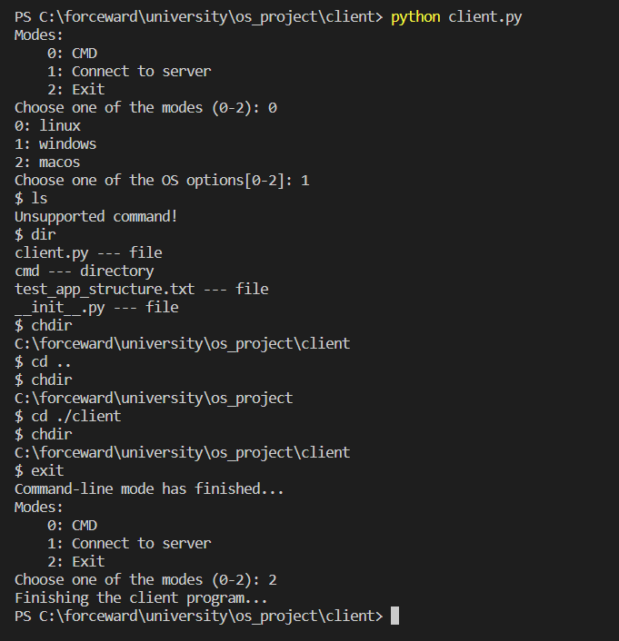

<!-- git commit -m "The bolerplate of the project was created. The CMD app with basic commands was implemented for the client." -->

# 
OS Project

## Client-Server application
### Was created by Umidjon Khabibullaev in a collaboration with professor Jaloliddin Yusupov.

 
 

 

Client:

All the logic of client is in package `client` of the root project folder. The main logic is written in client.py file.

Client app requires to select a mode. For now only the `CMD` mode is implemented. Once the mode is selected, the client calls its corresponding subapplication which is defined as a package inside the `client` package.

### <u>CMD Mode</u>
The CMD mode is an application which accepts the cmd commands of a chosen OS and serves these commands.

Example of usage:

    

